<p align="center">
  <a href="https://gittree.app">
    
  </a>
</p>

<h1 align="center">Git Tree</h1>

<p align="center">
  <strong>The visual Git client that keeps your work on your computer.</strong><br>
  A free, local-first Git GUI for macOS, Windows and Linux: a fast commit graph, line-level staging,<br>
  merge and rebase with undo, and your GitHub and Bitbucket accounts built in.
</p>

<p align="center">
  <a href="https://github.com/git-tree-app/gittree/releases/latest"></a>
  <a href="https://github.com/git-tree-app/gittree/releases"></a>
  
  
  
  
  
</p>

<p align="center">
  <a href="https://gittree.app/api/download/macos"><strong>Download for macOS</strong></a>
  &nbsp;·&nbsp;
  <a href="https://gittree.app/api/download/windows"><strong>Download for Windows</strong></a>
  &nbsp;·&nbsp;
  <a href="https://gittree.app/api/download/linux"><strong>Download for Linux</strong></a>
  &nbsp;·&nbsp;
  <a href="https://gittree.app">Website</a>
  &nbsp;·&nbsp;
  <a href="https://gittree.app/en/features">All features</a>
  &nbsp;·&nbsp;
  <a href="https://github.com/git-tree-app/gittree/issues/new/choose">Report a bug</a>
  &nbsp;·&nbsp;
  <a href="https://www.linkedin.com/company/gittreeapp">LinkedIn</a>
  &nbsp;·&nbsp;
  <a href="https://www.facebook.com/gittreeapp/">Facebook</a>
  &nbsp;·&nbsp;
  <a href="https://gittree.app/ar">العربية</a>
</p>

<p align="center">
  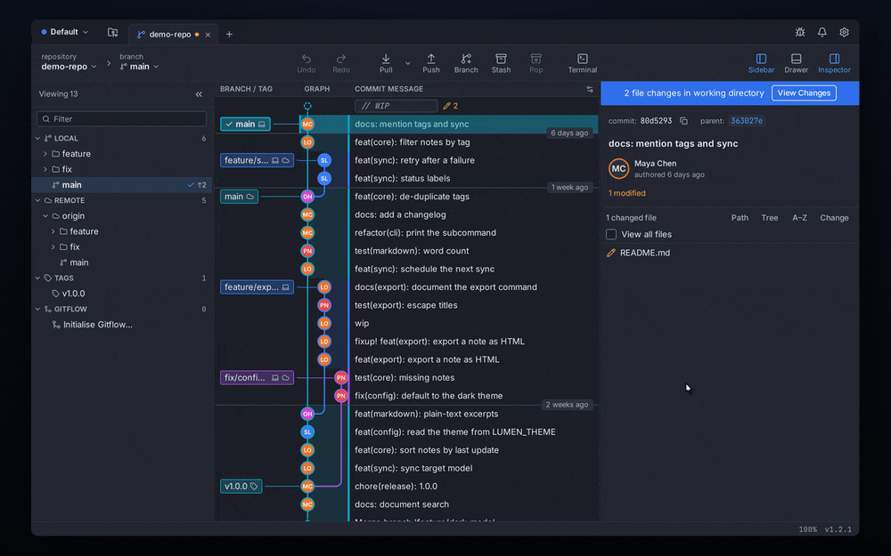
</p>

<p align="center">
  <sub>Recorded from the real app, not a mock-up.</sub>
</p>

---

## Contents

- [Download](#download)
- [About this repository](#about-this-repository)
- [Why Git Tree](#why-git-tree)
- [How it compares](#how-it-compares)
- [Features](#features)
- [Installation](#installation)
- [Getting started](#getting-started)
- [How to…](#how-to)
- [Keyboard shortcuts](#keyboard-shortcuts)
- [Your Git Tree account](#your-git-tree-account)
- [Privacy and security](#privacy-and-security)
- [Updating and uninstalling](#updating-and-uninstalling)
- [Troubleshooting](#troubleshooting)
- [FAQ](#faq)
- [Feedback and support](#feedback-and-support)
- [Author](#author)
- [Legal](#legal)
- [بالعربية](#بالعربية)

---

## Download

| Platform | Requirements | Installer | Download |
|---|---|---|---|
| **macOS** | macOS 13 Ventura or later, Apple silicon (M1–M4) and Intel | One universal `.dmg` | [**Download for macOS**](https://gittree.app/api/download/macos) |
| **Windows** | Windows 10 (22H2) or Windows 11, 64-bit | x64 installer `…_x64-setup.exe` | [**Download for Windows**](https://gittree.app/api/download/windows) |
| **Linux** | Ubuntu 22.04 LTS or later, Debian 12 or later (and derivatives with WebKitGTK 4.1, such as Linux Mint 21+), 64-bit | Debian package `…_amd64.deb` (recommended) · portable `…_amd64.AppImage` | [**Download the .deb**](https://gittree.app/api/download/linux) · [AppImage](https://gittree.app/api/download/linux-appimage) |

These links always fetch the installer of the **newest release** straight from this repository — there is nothing to pick.
Every version, with its release notes and checksums, is listed on the [**Releases page**](https://github.com/git-tree-app/gittree/releases).
You can also download from the website: [gittree.app/en/download](https://gittree.app/en/download).

Prefer to skip the website? These links are served by GitHub itself, never change, and always point to the newest release:
[`Git-Tree-macOS.dmg`](https://github.com/git-tree-app/gittree/releases/latest/download/Git-Tree-macOS.dmg) ·
[`Git-Tree-Windows-setup.exe`](https://github.com/git-tree-app/gittree/releases/latest/download/Git-Tree-Windows-setup.exe) ·
[`Git-Tree-Linux.deb`](https://github.com/git-tree-app/gittree/releases/latest/download/Git-Tree-Linux.deb) ·
[`Git-Tree-Linux.AppImage`](https://github.com/git-tree-app/gittree/releases/latest/download/Git-Tree-Linux.AppImage).

> [!NOTE]
> Git Tree uses **your own Git** (version 2.39 or newer). If Git is not installed, the app tells you how to install it — see [Install Git](#install-git). Ubuntu 22.04 ships an older Git, so it needs one extra step there.

> [!TIP]
> Pre-releases (betas) are marked **Pre-release** on the Releases page. The download buttons only ever serve stable releases.

## About this repository

This is the **public home of Git Tree**: its releases, its public files and its issue tracker. The source code of the app, the website and the account service is private.

| You'll find here | |
|---|---|
| **Releases** | Installers for macOS (`.dmg`), Windows (`.exe`) and Linux (`.deb`, `.AppImage`), release notes and SHA-256 checksums, on the [Releases page](https://github.com/git-tree-app/gittree/releases). |
| **Issues** | Bug reports and feature requests — [open one](https://github.com/git-tree-app/gittree/issues/new/choose). |
| **Public files** | The logo and screenshots used in this README (`.github/assets/`). |

The website, [**gittree.app**](https://gittree.app), downloads from this repository: when a new version is published here, the website's download buttons serve it within minutes.

## Why Git Tree

- **See your whole repository.** Every branch gets its own colour-coded lane, so merges, releases and feature work read at a glance — smoothly past **100,000 commits**.
- **Every everyday Git action is one click away.** Stage, commit, branch, merge, rebase, stash, pull and push — from the graph, the toolbar or a right-click. Menus name both branches ("Merge `feature/search` into `develop`"), so there is never a guess.
- **You can't lose work by clicking the wrong button.** Destructive actions save a recoverable snapshot first, and **Undo / Redo** in the toolbar reverse them. Force-push always uses `--force-with-lease`. Dangerous dialogs focus **Cancel**.
- **Local-first, zero telemetry.** Your repositories never leave your computer. No analytics, no tracking, no usage reporting — the only network traffic is what you start.
- **Your own Git.** Every command runs through the Git you already have, so everything matches what the command line would do.
- **Native on both platforms.** A small, fast desktop app built with Rust that respects each platform's window controls, shortcuts, keychain and file system.

## How it compares

Honest, neutral and short: only rows where each answer is known. GitTree's column describes what is in the app today; roadmap items are never ticked.

| | **GitTree** | GitKraken Desktop | Sourcetree | Fork |
|---|---|---|---|---|
| **Price** | Free, private repositories included | Free for local and public repositories; private remotes need a paid plan after a 14-day trial | Free <!-- VERIFY --> | One-time licence after a free evaluation <!-- VERIFY --> |
| **macOS · Windows · Linux** | ✅ ✅ ✅ (Ubuntu and Debian, x86_64) | ✅ ✅ ✅ | ✅ ✅ ❌ <!-- VERIFY --> | ✅ ✅ ❌ <!-- VERIFY --> |
| **Account to sign in** | Free GitTree account | GitKraken account | Atlassian account <!-- VERIFY --> | None <!-- VERIFY --> |
| **Commit graph** | ✅ | ✅ | ✅ <!-- VERIFY --> | ✅ <!-- VERIFY --> |
| **Interactive rebase** | ✅ | ✅ | ✅ <!-- VERIFY --> | ✅ <!-- VERIFY --> |
| **Built-in conflict editor** | ✅ three-way | ✅ | External merge tool <!-- VERIFY --> | ✅ <!-- VERIFY --> |
| **Undo for rebases, resets and discards** | ✅ toolbar Undo and Redo | ✅ | No undo button <!-- VERIFY --> | No undo button <!-- VERIFY --> |
| **Conflict warning before a merge** | ✅ in the merge dialog | Paid plan <!-- VERIFY --> | ❌ <!-- VERIFY --> | ❌ <!-- VERIFY --> |

<sub>Last checked: 2 October 2026, against the vendors' own sites ([GitKraken](https://www.gitkraken.com/pricing), [Sourcetree](https://www.sourcetreeapp.com), [Fork](https://git-fork.com)). Plans and features change; if a cell is out of date, please [open an issue](https://github.com/git-tree-app/gittree/issues/new/choose). GitKraken, Sourcetree and Fork are trademarks of their owners; GitTree is not affiliated with or endorsed by them.</sub>

## Features

Git Tree covers the commands developers use every day, plus the advanced ones you reach for when something needs fixing. The complete, always-current list is on [gittree.app/en/features](https://gittree.app/en/features).

### Commit graph

- **Colour-coded branch lanes** with smooth curves where branches fork and merge.
- **Fast on huge repositories** — designed and tested to scroll smoothly past 100,000 commits.
- **Labels on the graph** — local branches, remote branches and tags next to the commits they point to, plus avatars and relative dates.
- **Search and filter** — find commits by message, author or hash; show or hide branches.
- **Work-in-progress row** — uncommitted changes appear at the top of the graph with a count of what changed.

<p align="center">
  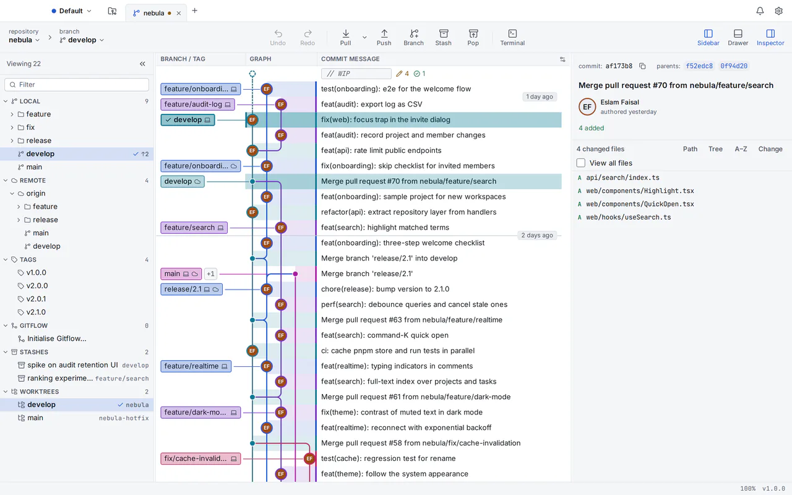
</p>

### Staging and commits

- **File, hunk and line staging** — stage or unstage a whole file, one hunk or individual lines.
- **Discard with a safety net** — discarding asks first and keeps a copy you can restore.
- **Commit, amend and co-authors** with one click.
- **Message checks** — a live counter keeps the summary within 72 characters; templates and recent messages are one click away.
- **Signed commits** with the GPG or SSH keys you already use.
- **`.gitignore` editor** — ignore a file or pattern from its context menu, or edit `.gitignore` with templates.

<table>
  <tr>
    <td width="50%">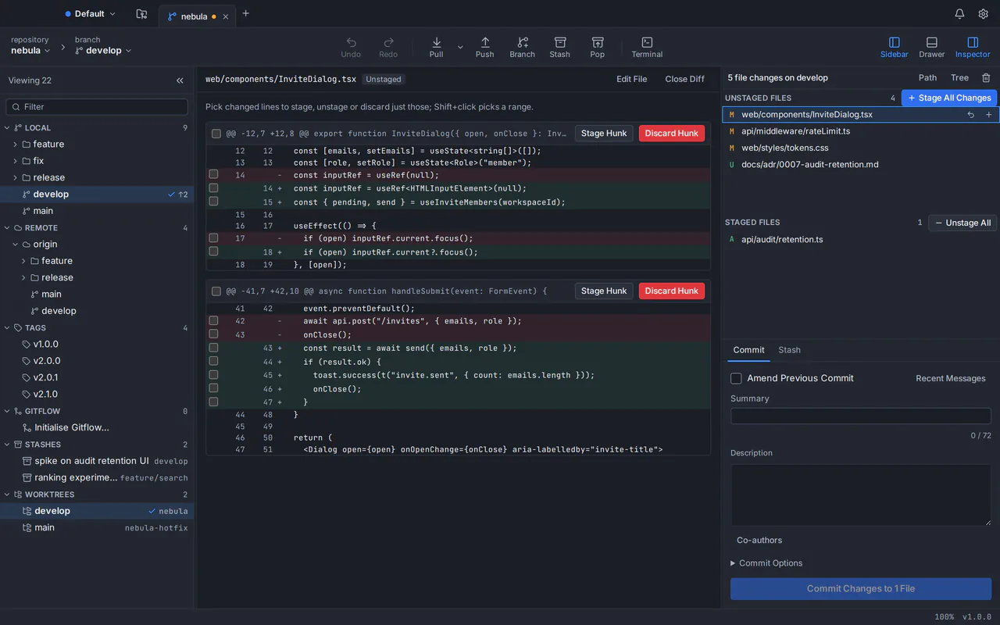</td>
    <td width="50%">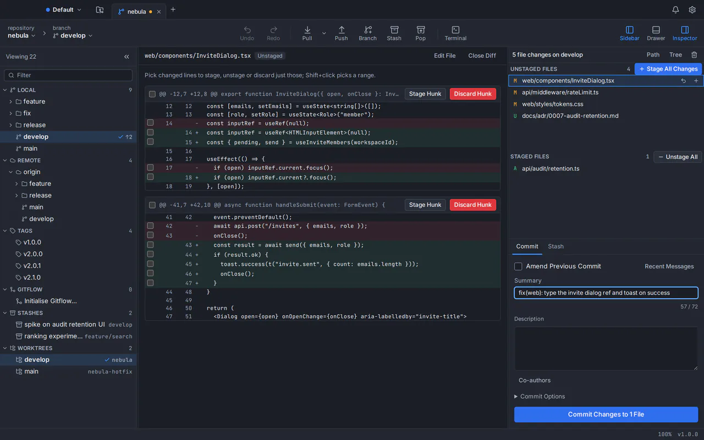</td>
  </tr>
  <tr>
    <td align="center"><sub>Stage a file, a hunk or single lines</sub></td>
    <td align="center"><sub>Write the message with a live summary check</sub></td>
  </tr>
</table>

### Diff, blame and history

- **Split and inline diffs** with syntax highlighting for dozens of languages and whitespace options.
- **Blame** — see who last changed every line and jump to that commit.
- **File history** that follows a file through renames.
- **Compare anything** — two branches, tags or commits, or a commit with your working folder.
- **Image diffs** — compare image files side by side.

<p align="center">
  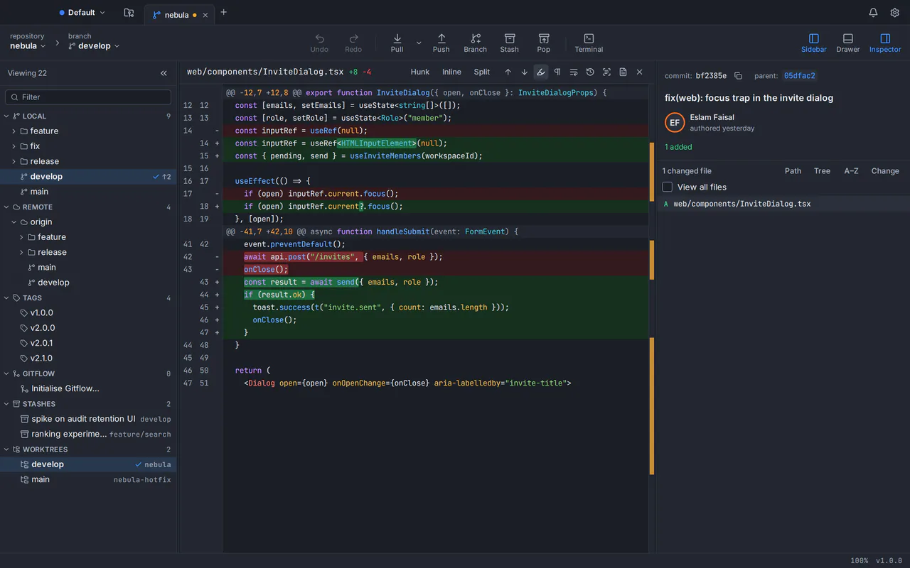
</p>

### Branches and tags

- **Create, rename and delete** — branch from any commit; rename or delete safely.
- **Checkout with protection** — a warning before a checkout would overwrite your local changes.
- **Tags** — lightweight or annotated; push and delete them.
- **Upstream tracking** — ahead/behind counts for every branch and one-click upstream setup.
- **Git Flow** — start and finish feature, release and hotfix branches.

### Merge, rebase and conflicts

- **Merge and fast-forward** — menus name both branches, so you always know which way changes move.
- **Rebase** onto any branch or commit, with continue, skip and abort in one place.
- **Cherry-pick and revert** — copy a commit onto your branch, or undo it with a new commit.
- **Reset** — soft, mixed and hard, each with a plain-language explanation.
- **Conflict resolution tool** — take a side, combine both, or edit the result, then mark the file resolved.
- **Conflict prediction** — see which files are likely to conflict before you merge.

<table>
  <tr>
    <td width="50%">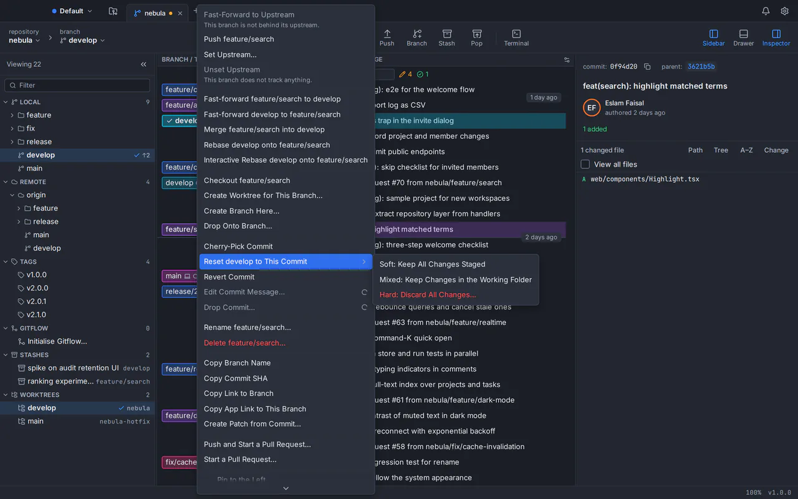</td>
    <td width="50%">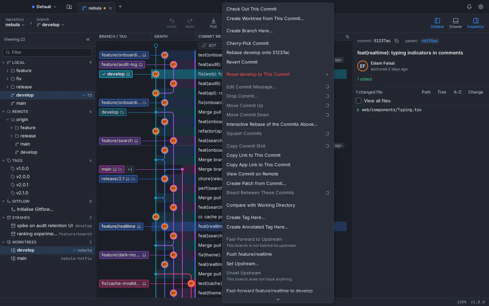</td>
  </tr>
  <tr>
    <td align="center"><sub>Branch menu: every action names both branches</sub></td>
    <td align="center"><sub>Commit menu: cherry-pick, revert, branch, tag, compare</sub></td>
  </tr>
</table>

### Rewrite history and undo

- **Interactive rebase** — reorder by dragging, then pick, reword, edit, squash, fixup or drop. Git Tree shows exactly what will be replayed before anything changes.
- **Quick edits** — reword, move, squash or drop a single commit straight from its menu.
- **Undo and redo** — reverse resets, discards, deletions and rebases from the toolbar.
- **Reflog** — browse it and recover a lost commit onto a new branch.
- **Bisect** — find the commit that introduced a bug by marking commits good or bad.

<p align="center">
  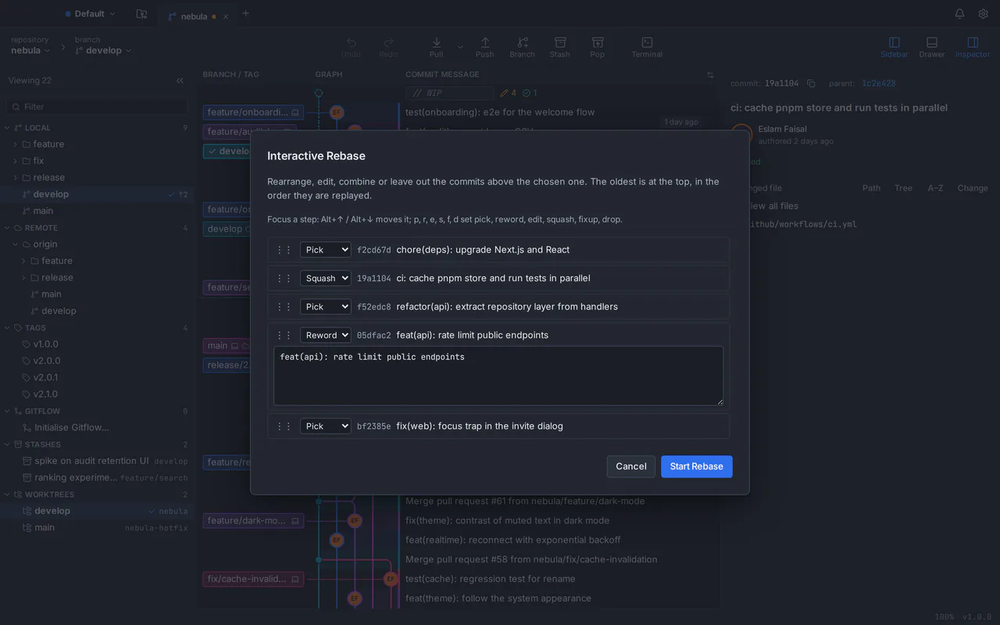
</p>

### Stash, worktrees, submodules and LFS

- **Stash** — stash, apply, pop, rename and drop, or turn a stash into a branch.
- **Worktrees** — check out several branches at once in separate folders, from the sidebar.
- **Submodules** — add, initialise, update and sync.
- **Git LFS** — track patterns, pull large files and manage file locks.
- **Patches** — create a patch from commits and apply patches from others.

### Remotes and sync

- **Fetch, pull and push** — choose fast-forward only, merge or rebase for every pull.
- **Safe force-push** — always `--force-with-lease` with the expected commit.
- **Multiple remotes** over HTTPS or SSH — add, edit, prune and remove.
- **Shallow history** — work with shallow clones and fetch more history when you need it.

### GitHub, Bitbucket and more

- **Connect accounts** — GitHub and Bitbucket Cloud; tokens are stored in your system keychain.
- **Browse and clone** your repositories without copying a URL.
- **Pull requests** — list, create and review them, and see their checks.
- **Publish** a local repository to a new remote repository.
- **Early support** for GitHub Enterprise Server, GitLab (gitlab.com and self-managed), Azure DevOps and Bitbucket Data Center.

### Speed and productivity

- **Command palette** — <kbd>⌘</kbd><kbd>⇧</kbd><kbd>P</kbd> / <kbd>Ctrl</kbd><kbd>Shift</kbd><kbd>P</kbd> runs any command, jumps to a branch, finds a commit or opens a file.
- **Rebindable shortcuts** — every command has a shortcut you can change.
- **Built-in terminal** docked under the graph, opened at the repository root with your own shell and profile; the graph refreshes when the repository changes.
- **Tabs and workspaces** — open many repositories in tabs and group them into workspaces; your session comes back exactly as you left it.
- **Custom commands** — add your own commands and scripts.

<table>
  <tr>
    <td width="50%">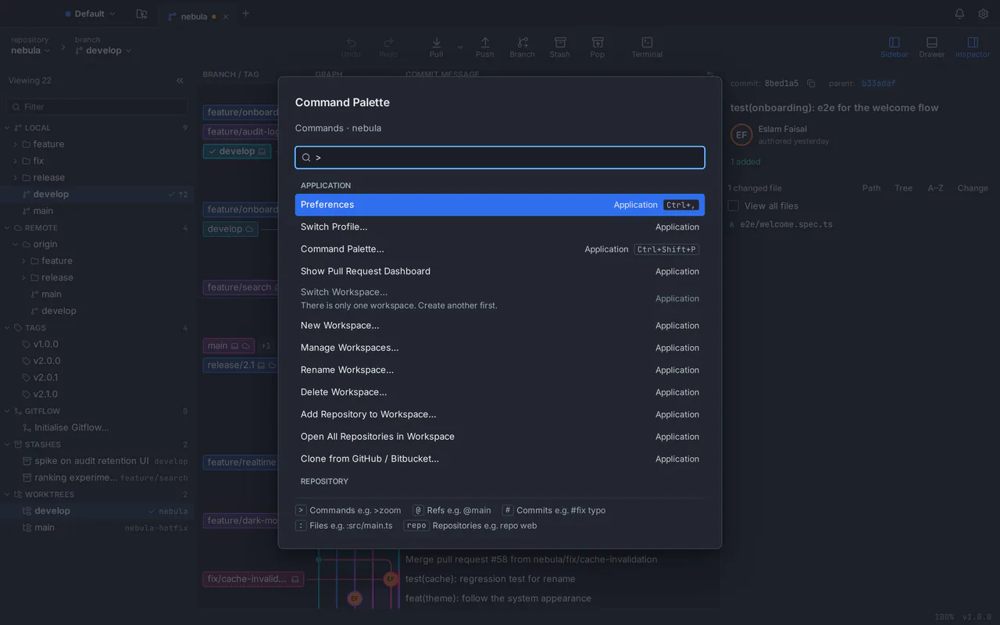</td>
    <td width="50%">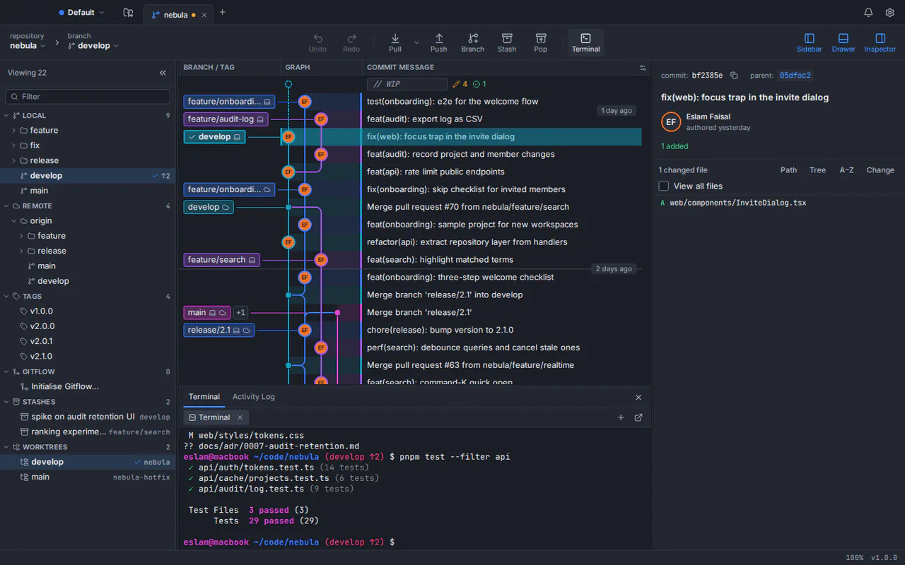</td>
  </tr>
  <tr>
    <td align="center"><sub>Command palette</sub></td>
    <td align="center"><sub>Built-in terminal</sub></td>
  </tr>
</table>

### Repositories: open, clone, init

- **Open, clone or init** from the start page, with recent and favourite repositories.
- **Clone over HTTPS or SSH**, including shallow, sparse and blobless clones.
- **Scan for Repositories** in a folder to find the ones you already have.

<table>
  <tr>
    <td width="50%">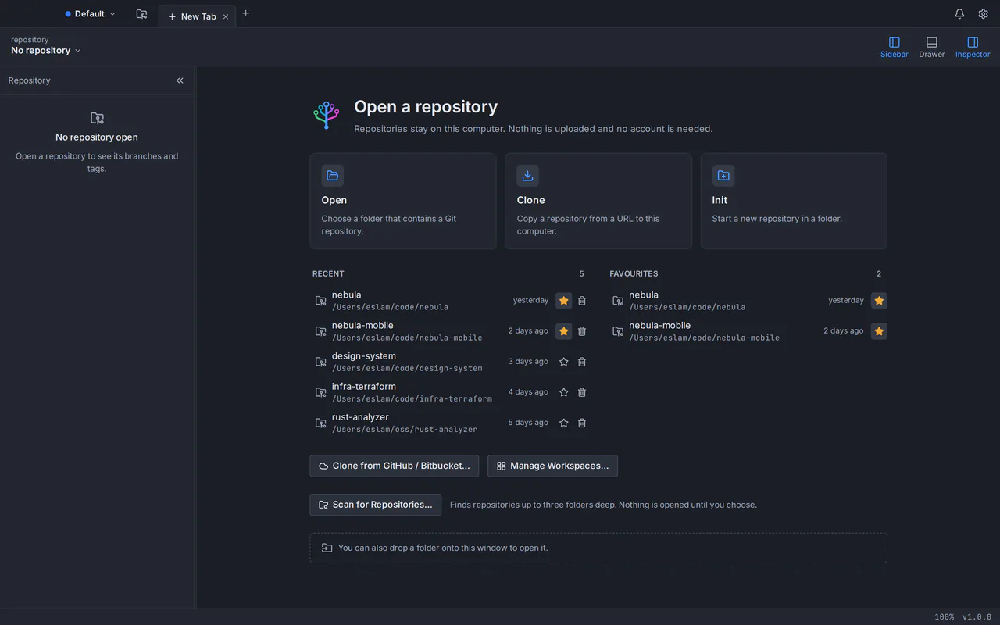</td>
    <td width="50%">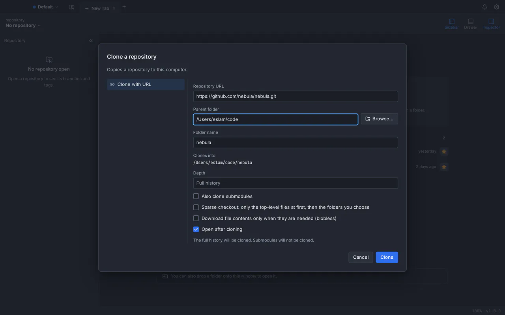</td>
  </tr>
  <tr>
    <td align="center"><sub>Start page</sub></td>
    <td align="center"><sub>Clone with depth, sparse and blobless options</sub></td>
  </tr>
</table>

### Preferences and customisation

- **Searchable preferences** — find any setting by name, description or key, and reset it individually.
- **Themes** — dark, light and high-contrast, plus your own imported themes.
- **SSH and signing** — manage SSH keys and configure commit signing.
- **External tools** — open diffs and merges in the tools you prefer.
- **Profiles** — switch between separate identities (name, email, signing key) for work and personal projects.

<p align="center">
  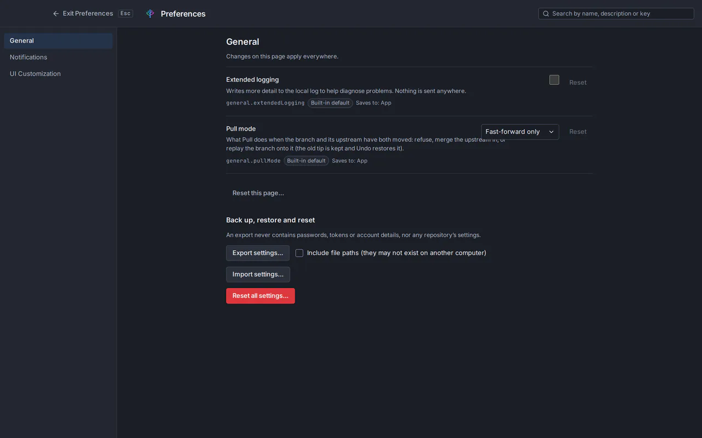
</p>

### Privacy and security

- **Your code stays local** — repositories stay on your computer; signing in uses only your GitHub profile.
- **Zero telemetry** — no analytics, tracking or usage reporting of any kind.
- **Secrets in the keychain** — tokens and passphrases live only in the macOS Keychain, the Windows Credential Manager or, on Linux, the system keyring (Secret Service: GNOME Keyring, KeePassXC).
- **Untrusted repositories** cannot run hooks or change settings until you trust them.
- **Your config stays yours** — Git Tree never edits your Git config, repository or `~/.ssh` without you asking.

## Installation

### macOS

1. [Download the `.dmg`](https://gittree.app/api/download/macos) — one universal app for Apple silicon and Intel.
2. Open the downloaded `Git-Tree_<version>_universal.dmg`.
3. Drag **Git Tree** into **Applications**.
4. Open **Git Tree** from Applications, Launchpad or Spotlight.

A release that is signed with an Apple Developer ID and notarized opens without a warning; its notes say so. Until then macOS asks you to confirm the first launch: **Control-click** (right-click) **Git Tree** in Applications, choose **Open**, then **Open** again. If macOS reports that the app "is damaged", the download was quarantined without a signature; run `xattr -dr com.apple.quarantine "/Applications/Git Tree.app"` once and open it again. To check a signed build yourself:

```bash
codesign --verify --deep --strict --verbose=2 "/Applications/Git Tree.app"
spctl --assess --type execute --verbose "/Applications/Git Tree.app"   # "accepted, source=Notarized Developer ID"
```

### Windows

1. [Download the installer](https://gittree.app/api/download/windows) — `Git-Tree_<version>_x64-setup.exe`.
2. Run it. Git Tree installs for all users on the computer, so Windows asks for administrator permission.
3. Open **Git Tree** from the Start menu.

Git Tree uses Microsoft Edge **WebView2**, which Windows 11 includes; on Windows 10 the installer sets it up if it is missing.

> [!IMPORTANT]
> Only install Git Tree from [gittree.app](https://gittree.app) or this repository's [Releases page](https://github.com/git-tree-app/gittree/releases). If Windows SmartScreen says *"Windows protected your PC"* for a brand-new release, check the file's checksum (below) before choosing **More info → Run anyway**.

### Linux (Ubuntu and Debian)

Git Tree needs Git 2.39 or newer. Ubuntu 24.04 and Debian 12 already have it. **Ubuntu 22.04 and Linux Mint 21 ship Git 2.34**, so add a current Git first:

```bash
sudo add-apt-repository ppa:git-core/ppa
sudo apt update
sudo apt install git
```

1. [Download the `.deb`](https://gittree.app/api/download/linux) — `Git-Tree_<version>_amd64.deb` (or the stable name `Git-Tree-Linux.deb`).
2. Install it; apt also installs what it needs (Git, WebKitGTK, GTK):
   ```bash
   sudo apt install ./Git-Tree_<version>_amd64.deb
   ```
3. Open **Git Tree** from the application menu.

**Sign-in and passwords.** The app keeps your sign-in and tokens in the system keyring through the Secret Service. GNOME Keyring comes with Ubuntu; on other desktops install `gnome-keyring` or turn on KeePassXC's Secret Service integration. The keyring must be unlocked and have a default collection; if none answers, Git Tree tells you what to install and keeps nothing anywhere else. When Git asks for an HTTPS password or an SSH passphrase, the app shows the prompt with `zenity` or `kdialog` (recommended by the package).

**Prefer a portable file?** Download the [AppImage](https://gittree.app/api/download/linux-appimage), then:

```bash
chmod +x Git-Tree_<version>_amd64.AppImage
./Git-Tree_<version>_amd64.AppImage
```

Keep the AppImage in a folder only you can write to. If it does not start because FUSE is missing, install it with `sudo apt install fuse3`. An AppImage registers nothing with your system, so after signing in the browser cannot hand you back to the app: choose **Manually enter authentication code** in the app and paste the code the website shows (the `.deb` handles the return automatically).

> [!IMPORTANT]
> The Linux packages are not signed. Verify the download against `SHA256SUMS.txt` ([Verify your download](#verify-your-download-optional)) and install only from [gittree.app](https://gittree.app) or this repository's [Releases page](https://github.com/git-tree-app/gittree/releases).

### Install Git

Git Tree never bundles or installs Git for you — it uses yours (2.39 or newer).

| | |
|---|---|
| **macOS** | `xcode-select --install` (Xcode Command Line Tools), or `brew install git` with [Homebrew](https://brew.sh) |
| **Windows** | Install [Git for Windows](https://git-scm.com/download/win), then restart Git Tree |
| **Linux** | Ubuntu 24.04 and Debian 12: `sudo apt install git`. Ubuntu 22.04 and Linux Mint 21: add the [Git PPA](https://launchpad.net/~git-core/+archive/ubuntu/ppa) first (`sudo add-apt-repository ppa:git-core/ppa && sudo apt update`), then `sudo apt install git`. Restart Git Tree afterwards |

Check your version with `git --version`. For Git LFS: `brew install git-lfs` on macOS; on Windows it comes with Git for Windows (or `winget install GitHub.GitLFS`); on Ubuntu and Debian `sudo apt install git-lfs`.

### Verify your download (optional)

Each release attaches `SHA256SUMS.txt` with the SHA-256 checksum of every installer. Compare the line for your file with the one you downloaded:

```bash
# macOS
shasum -a 256 ~/Downloads/Git-Tree*.dmg
```

```powershell
# Windows (PowerShell)
Get-FileHash "$env:USERPROFILE\Downloads\Git-Tree*setup.exe" -Algorithm SHA256
```

```bash
# Linux: put SHA256SUMS.txt next to the downloads, then
cd ~/Downloads && sha256sum -c --ignore-missing SHA256SUMS.txt
```

`SHA256SUMS.txt` is published in the same place as the installers, so it catches a corrupted or truncated download, not a tampered release. Download only from the sources named above.

## Getting started

1. **Install Git Tree** and [Git](#install-git), then open the app.
2. **Sign in.** Choose **Sign in** (or **Create account**). Your browser opens [gittree.app](https://gittree.app), where you sign in with GitHub and confirm *"Sign in to Git Tree"*. The browser hands you back to the app, which continues by itself.
   - Browser didn't come back? The website shows a one-time code: choose **Manually enter authentication code** in the app and paste it.
   - The account is free. Git Tree asks GitHub only for your public profile and email address; your repositories stay on your computer.
3. **Open a repository.** From the start page choose **Open** (a folder on your computer), **Clone** (from a URL or your connected accounts) or **Init** (a new repository). **Scan for Repositories** finds the ones you already have in a folder.
   - **Pull requests and issues.** Signing in to Git Tree does not connect your hosting account. For a repository on GitHub (or Bitbucket, GitLab, Azure DevOps) the sidebar shows **Connect github.com to see pull requests and issues…**; choose it (or open **Preferences → Integrations**) and connect the account once. The sidebar then lists the repository's open pull requests, with their checks, and its issues.
4. **Find your way around.**

   | Area | What it shows |
   |---|---|
   | **Tabs** (top) | One tab per open repository; <kbd>⌘</kbd><kbd>T</kbd> / <kbd>Ctrl</kbd><kbd>T</kbd> opens a new one |
   | **Toolbar** | Undo, Redo, Pull, Push, Branch, Stash, Pop and Terminal, plus the Sidebar, Drawer and Inspector toggles |
   | **Sidebar** (left) | Local and remote branches, tags, Git Flow, stashes and worktrees, with a filter |
   | **Graph** (centre) | Branch/tag labels, the lanes and the commit messages; the *WIP* row on top holds your uncommitted changes |
   | **Inspector** (right) | The selected commit's details and changed files, or the staging area and commit message for the WIP row |

## How to…

<details>
<summary><strong>Stage and commit changes</strong></summary>

1. Select the **WIP** row at the top of the graph.
2. Stage a whole file, open it to stage a single **hunk**, or tick individual **lines**. With a file list focused, <kbd>S</kbd> stages and <kbd>U</kbd> unstages the selection.
3. Write a summary (the counter turns red past 72 characters) and an optional description.
4. Choose **Commit**, or press <kbd>⌘</kbd><kbd>Enter</kbd> / <kbd>Ctrl</kbd><kbd>Enter</kbd>. Choose **Amend Previous Commit** to change the last commit instead.
</details>

<details>
<summary><strong>Create and switch branches</strong></summary>

- Choose **Branch** in the toolbar, or right-click any commit → **Create Branch Here…**.
- Double-click a branch label on the graph, or right-click it → **Check Out Branch**. Git Tree warns you first if your local changes would be overwritten.
- Right-click a branch to rename or delete it, set its upstream, push it or fast-forward it.
</details>

<details>
<summary><strong>Merge or rebase</strong></summary>

1. Check out the branch that should receive the changes.
2. Right-click the other branch → **Merge *other* into *current*** (or **Rebase *current* onto *other***).
3. If there are conflicts, the conflicted files are listed: open each one, take a side, combine both or edit the result, then mark it resolved and continue — or abort to go back.
</details>

<details>
<summary><strong>Clean up history with an interactive rebase</strong></summary>

1. Right-click a commit → **Interactive Rebase of the Commits Above…** (or right-click a branch → **Interactive Rebase Current Branch Onto This…**).
2. Drag commits to reorder them, and set each one to *pick*, *reword*, *edit*, *squash*, *fixup* or *drop*.
3. Review what will be replayed, then start. A snapshot is taken first, so **Undo** can reverse the whole rebase.

For a single commit, its menu offers quick edits: **Edit Commit Message…**, **Move Commit Up / Down** and **Drop Commit…**.
</details>

<details>
<summary><strong>Pull, push and force-push safely</strong></summary>

- **Pull** in the toolbar fetches and integrates; the arrow next to it chooses **fast-forward only**, **fast-forward if possible** (merge) or **rebase**.
- **Push** sends the current branch to its remote.
- When a push needs force, Git Tree uses `--force-with-lease` with the commit it expects on the remote, so it never overwrites work you haven't seen.
</details>

<details>
<summary><strong>Undo a mistake</strong></summary>

Resets, discards, branch deletions and rebases save a recoverable snapshot before they run. Choose **Undo** in the toolbar to reverse the last one, and **Redo** to apply it again. For anything older, the **reflog** can recover a lost commit onto a new branch.
</details>

<details>
<summary><strong>Stash work and use worktrees</strong></summary>

- **Stash** in the toolbar saves your uncommitted changes; **Pop** brings them back. Right-click a stash in the sidebar to apply, rename or drop it, or **Create Branch from Stash…**.
- The **Worktrees** section of the sidebar checks out another branch in a separate folder, so you can work on two branches at once.
</details>

<details>
<summary><strong>Connect GitHub or Bitbucket and work with pull requests</strong></summary>

1. Open **Preferences** (<kbd>⌘</kbd><kbd>,</kbd> / <kbd>Ctrl</kbd><kbd>,</kbd>) → **Integrations**.
2. Connect GitHub (sign in with the browser, or use a personal access token) or Bitbucket Cloud (API or access token). Tokens are stored only in your system keychain.
3. Clone from your account's repository list, publish a local repository, and list, create and review pull requests with their checks.
</details>

<details>
<summary><strong>Use the command palette and terminal</strong></summary>

- <kbd>⌘</kbd><kbd>⇧</kbd><kbd>P</kbd> / <kbd>Ctrl</kbd><kbd>Shift</kbd><kbd>P</kbd> opens the palette: type to run a command, jump to a branch, find a commit or open a file.
- **Terminal** in the toolbar opens a terminal at the repository root, with your own shell and profile.
- <kbd>⌘</kbd><kbd>/</kbd> / <kbd>Ctrl</kbd><kbd>/</kbd> shows every keyboard shortcut.
</details>

<details>
<summary><strong>Make it yours</strong></summary>

- **Preferences** are searchable; every setting can be reset on its own.
- Pick the dark, light or high-contrast theme, or import your own.
- Rebind any shortcut, add custom commands, and set up **profiles** to switch name, email and signing key between work and personal projects.
</details>

## Keyboard shortcuts

<kbd>⌘</kbd> on macOS is <kbd>Ctrl</kbd> on Windows and Linux. Every shortcut can be changed in Preferences; <kbd>⌘</kbd><kbd>/</kbd> shows the full list in the app.

| Action | macOS | Windows and Linux |
|---|---|---|
| Command palette | <kbd>⌘</kbd><kbd>⇧</kbd><kbd>P</kbd> | <kbd>Ctrl</kbd><kbd>Shift</kbd><kbd>P</kbd> |
| Keyboard shortcuts | <kbd>⌘</kbd><kbd>/</kbd> | <kbd>Ctrl</kbd><kbd>/</kbd> |
| Open a repository | <kbd>⌘</kbd><kbd>O</kbd> | <kbd>Ctrl</kbd><kbd>O</kbd> |
| New tab / close tab | <kbd>⌘</kbd><kbd>T</kbd> / <kbd>⌘</kbd><kbd>W</kbd> | <kbd>Ctrl</kbd><kbd>T</kbd> / <kbd>Ctrl</kbd><kbd>W</kbd> |
| Next / previous tab | <kbd>⌃</kbd><kbd>Tab</kbd> / <kbd>⌃</kbd><kbd>⇧</kbd><kbd>Tab</kbd> | <kbd>Ctrl</kbd><kbd>Tab</kbd> / <kbd>Ctrl</kbd><kbd>Shift</kbd><kbd>Tab</kbd> |
| Preferences | <kbd>⌘</kbd><kbd>,</kbd> | <kbd>Ctrl</kbd><kbd>,</kbd> |
| Search the graph | <kbd>⌘</kbd><kbd>F</kbd> | <kbd>Ctrl</kbd><kbd>F</kbd> |
| Jump to HEAD | <kbd>⌘</kbd><kbd>⇧</kbd><kbd>H</kbd> | <kbd>Ctrl</kbd><kbd>Shift</kbd><kbd>H</kbd> |
| Stage / unstage the selected files | <kbd>S</kbd> / <kbd>U</kbd> | <kbd>S</kbd> / <kbd>U</kbd> |
| Commit | <kbd>⌘</kbd><kbd>Enter</kbd> | <kbd>Ctrl</kbd><kbd>Enter</kbd> |
| Next / previous change in a diff | <kbd>F7</kbd> / <kbd>⇧</kbd><kbd>F7</kbd> | <kbd>F7</kbd> / <kbd>Shift</kbd><kbd>F7</kbd> |
| Toggle sidebar / inspector | <kbd>⌘</kbd><kbd>J</kbd> / <kbd>⌘</kbd><kbd>K</kbd> | <kbd>Ctrl</kbd><kbd>J</kbd> / <kbd>Ctrl</kbd><kbd>K</kbd> |
| Toggle the drawer | <kbd>⌥</kbd><kbd>T</kbd> | <kbd>Alt</kbd><kbd>T</kbd> |
| Zoom in / out / reset | <kbd>⌘</kbd><kbd>=</kbd> / <kbd>⌘</kbd><kbd>-</kbd> / <kbd>⌘</kbd><kbd>0</kbd> | <kbd>Ctrl</kbd><kbd>=</kbd> / <kbd>Ctrl</kbd><kbd>-</kbd> / <kbd>Ctrl</kbd><kbd>0</kbd> |

## Your Git Tree account

Official Git Tree builds ask you to sign in with a free **Git Tree account**. You create it on the website by signing in with GitHub, and you manage everything about it there — never in the app.

| Page | What you can do |
|---|---|
| [Dashboard](https://gittree.app/en/dashboard) | Overview, download links and quick links |
| [Organizations](https://gittree.app/en/dashboard/organizations) | Create organizations, invite members by GitHub username, email or link, manage roles, accept invitations |
| [Account settings](https://gittree.app/en/dashboard/settings) | Account type (individual or organization), sign out, **delete your account** |

What the account stores, and what it doesn't, is spelled out in the [Privacy policy](https://gittree.app/en/privacy). Deleting your account removes your profile, linked provider accounts, organization memberships and sign-in record.

## Privacy and security

- **No telemetry, ever.** No analytics, crash reporting or usage tracking leaves your computer.
- **Your repositories stay local.** Git Tree has no cloud copy of your code. With default settings the app only talks to the Git remotes you fetch from and push to, the hosting accounts you connect, the Git Tree account service for sign-in, and an update check you can switch off.
- **Secrets live only in your OS keychain** — the macOS Keychain, the Windows Credential Manager or the Linux Secret Service (GNOME Keyring, KeePassXC) — never in files, logs or URLs. Other programs of your desktop session that you allow to use the Secret Service can see the same unlocked keyring, as with any Linux app.
- **Safe by design.** Snapshots before destructive operations, Undo/Redo, `--force-with-lease`, Cancel as the default in dangerous dialogs, and untrusted repositories can't run hooks.
- **Hands off your setup.** Git Tree never edits your Git config, a repository or `~/.ssh` without an explicit action from you.

Read the full [Privacy policy](https://gittree.app/en/privacy) and [Terms of use](https://gittree.app/en/terms). To report a security vulnerability, see [Feedback and support](#feedback-and-support).

## Updating and uninstalling

**Updating.** Versions after 1.0.1 update themselves. At launch Git Tree checks this repository's releases, and when a newer version exists a bar at the top of the window offers it with its release notes. Click **Download** to fetch it (the bar shows the progress; Git Tree checks the file against its published SHA-256 before anything is installed), then **Install and restart**:

- **macOS** replaces the app in Applications and reopens it.
- **Windows** runs the installer without questions after the administrator prompt, and reopens Git Tree.
- **Ubuntu and Debian** ask for your password (the system's administrator prompt) and upgrade the `git-tree` package; an **AppImage** is replaced where it is.

If Git Tree cannot install it for you (no permission to its folder, or you dismissed the prompt), it opens the installer so you can finish by hand. Git Tree waits for running Git operations and asks before closing open terminals; your settings, repositories list and sign-in stay as they are. Turn the launch check off in **Preferences → General → Automatically check for updates**; **Check for Updates…** in the command palette still works. You can also always download the newest version from the website or the [Releases page](https://github.com/git-tree-app/gittree/releases/latest) and install it over the current one (on Ubuntu and Debian, `sudo apt install ./Git-Tree_<version>_amd64.deb`; with the AppImage, replace the file). Watch this repository (**Watch → Custom → Releases**) to be told about each new version.

**Uninstalling on macOS.** Quit Git Tree and move **Git Tree** from Applications to the Bin. To also remove its settings, caches and logs, delete:

```text
~/Library/Application Support/com.eslamfaisal.opengittree
~/Library/Caches/com.eslamfaisal.opengittree
~/Library/Logs/com.eslamfaisal.opengittree
```

**Uninstalling on Windows.** *Settings → Apps → Installed apps → Git Tree → Uninstall.* To also remove its settings and caches, delete `%APPDATA%\com.eslamfaisal.opengittree` and `%LOCALAPPDATA%\com.eslamfaisal.opengittree`.

**Uninstalling on Linux.** `sudo apt remove git-tree` (or delete the AppImage). To also remove its settings, caches and logs, delete:

```text
~/.config/com.eslamfaisal.opengittree
~/.local/share/com.eslamfaisal.opengittree      # includes logs/
~/.cache/com.eslamfaisal.opengittree
```

(The locations follow `XDG_CONFIG_HOME`, `XDG_DATA_HOME` and `XDG_CACHE_HOME` if you set them.) Entries kept in the keyring are removed by disconnecting your accounts first, as below.

Disconnect your hosting accounts in **Preferences → Integrations** first if you want their tokens removed from your keychain.

## Troubleshooting

| Problem | What to do |
|---|---|
| *"Git was not found"* | Install Git 2.39 or newer ([Install Git](#install-git)), then restart Git Tree. |
| The browser doesn't return to the app after signing in | Use **Manually enter authentication code** in the app and paste the one-time code the website shows. Enter it only in the app that started the sign-in. |
| Ubuntu 22.04 or Linux Mint 21: *"This Git is too old"* | Those systems ship Git 2.34. Add the Git PPA and update Git ([Linux](#linux-ubuntu-and-debian)), then choose **Check again**. |
| Linux: Git Tree says no Secret Service answered | Install and start GNOME Keyring (`sudo apt install gnome-keyring`) or enable KeePassXC's Secret Service integration, make sure the default keyring is unlocked, then try again. |
| Linux: the file watcher reports a limit | Your system's inotify limit is reached. The message shows the exact `sysctl` setting to raise. |
| The download button opens the Releases page instead of downloading | No installer for your platform is published yet, or GitHub couldn't be reached — pick the file from the release's **Assets** list. |
| Windows SmartScreen warning | Check the file's SHA-256 against the release ([Verify your download](#verify-your-download-optional)), then **More info → Run anyway**. |
| macOS: *"Git Tree can't be opened because Apple cannot check it"* | The release is not notarized yet. Control-click **Git Tree** in Applications → **Open** → **Open** ([Installation](#macos)). |
| A remote asks for credentials every time | Connect the account in **Preferences → Integrations**, or set up an SSH key there; secrets are kept in your keychain. |
| Git Tree crashed or closed unexpectedly | Choose **Report on GitHub** in the crash window (or **Crash Reports…** later) to open the [crash report form](https://github.com/git-tree-app/gittree/issues/new?template=crash_report.yml). |
| Something else | [Open an issue](https://github.com/git-tree-app/gittree/issues/new/choose) with your Git Tree version (bottom-right of the window), your OS version and the steps to reproduce. |

## FAQ

<details>
<summary><strong>What is Git Tree?</strong></summary>

A free desktop Git client (a Git GUI) for macOS, Windows and Linux. It shows your repository as an interactive commit graph and lets you stage, commit, branch, merge, rebase, stash and push without typing Git commands.
</details>

<details>
<summary><strong>Is it free?</strong></summary>

Yes. Git Tree is free to download and use — no subscription, no trial, no licence key.
</details>

<details>
<summary><strong>Why do I need to sign in?</strong></summary>

Official builds use your free Git Tree account (created with GitHub on gittree.app) for organizations and upcoming account features. Signing in uses only your GitHub profile and email address — your repositories and code never leave your computer.
</details>

<details>
<summary><strong>Does Git Tree collect any data?</strong></summary>

No. There is no telemetry and no cloud copy of your code. Your account stores only what the [Privacy policy](https://gittree.app/en/privacy) lists.
</details>

<details>
<summary><strong>Which systems are supported?</strong></summary>

macOS 13 Ventura or later on Apple silicon and Intel (one universal app), 64-bit Windows 10 (22H2) and Windows 11, and 64-bit Linux: Ubuntu 22.04 LTS or later and Debian 12 or later (and derivatives with WebKitGTK 4.1).
</details>

<details>
<summary><strong>Is there a Linux version?</strong></summary>

Yes, for 64-bit Ubuntu and Debian: a `.deb` package and a portable AppImage. It needs Ubuntu 22.04 or later or Debian 12 or later, and Git 2.39 or newer (Ubuntu 22.04 needs the Git PPA first). Other distributions may run the AppImage if they ship WebKitGTK 4.1, but only Ubuntu and Debian are tested. There is no arm64, Flatpak or Snap build yet.
</details>

<details>
<summary><strong>Does it work with GitHub, GitLab and Bitbucket?</strong></summary>

It works with any Git remote over HTTPS or SSH. You can also connect GitHub and Bitbucket Cloud accounts to browse and clone repositories and to work with pull requests, with early support for GitHub Enterprise Server, GitLab, Azure DevOps and Bitbucket Data Center.
</details>

<details>
<summary><strong>Can I undo a mistake?</strong></summary>

Yes. Reset, discard, branch deletion and rebase save a recoverable snapshot first, and the toolbar's **Undo** and **Redo** reverse them.
</details>

<details>
<summary><strong>Is the source code available?</strong></summary>

No. Git Tree's source code is private; this repository hosts its releases, public files and issue tracker.
</details>

## Feedback and support

- 🐞 **Found a bug?** Click the **bug** button at the top right of Git Tree: it opens the [bug report form](https://github.com/git-tree-app/gittree/issues/new?template=bug_report.yml) with your Git Tree, system and Git versions filled in. Nothing is sent from the app; you describe the problem and submit it.
- 💥 **Did Git Tree crash?** In the crash window choose **Report on GitHub**: it copies the report and opens the [crash report form](https://github.com/git-tree-app/gittree/issues/new?template=crash_report.yml) here for you to paste it into. Nothing is ever sent from the app itself. Reports from earlier sessions are under **Crash Reports…**; on Linux they are saved in `~/.local/share/com.eslamfaisal.opengittree/logs`. Read the report before you post it.
- 💡 **Have an idea?** [Request a feature](https://github.com/git-tree-app/gittree/issues/new?template=feature_request.yml).
- 🔒 **Security issue?** Please don't open a public issue. Report it privately through [**Security → Report a vulnerability**](https://github.com/git-tree-app/gittree/security/advisories/new).
- ⭐ **Like Git Tree?** Star this repository and share [gittree.app](https://gittree.app).
- 📣 **Follow Git Tree** on [LinkedIn](https://www.linkedin.com/company/gittreeapp) and [Facebook](https://www.facebook.com/gittreeapp/) for releases and news.

## Author

<table>
  <tr>
    <td>
      <a href="https://github.com/eslamfaisal"></a>
    </td>
    <td>
      <strong>Eslam Faisal</strong><br>
      Principal Software Engineer &amp; Technical Architect — creator of Git Tree.<br><br>
      <a href="https://gittree.app"></a>
      <a href="https://www.linkedin.com/in/eslam-faisal-b01321312/"></a>
      <a href="https://github.com/eslamfaisal"></a>
    </td>
  </tr>
</table>

## Legal

© 2026 Eslam Faisal. All rights reserved. Git Tree is free to download and use under its [Terms of use](https://gittree.app/en/terms); it is provided as is, without warranty of any kind.

Git and the Git logo are trademarks of the Software Freedom Conservancy. GitHub, Bitbucket, GitLab, Azure DevOps, macOS, Windows, Linux, Ubuntu and Debian are trademarks of their respective owners. Git Tree is an independent project and is not affiliated with or endorsed by any of them.

---

## بالعربية

<div dir="rtl">

**Git Tree** عميل Git مرئي ومجاني لأنظمة macOS وWindows وLinux: رسم بياني سريع للإيداعات، وتجهيز الملفات حتى مستوى السطر، ودمج وإعادة تأسيس مع إمكانية التراجع، وحساباتك على GitHub وBitbucket مدمجة. مستودعاتك تبقى على جهازك، ولا يُرسل التطبيق أي بيانات استخدام.

- **تنزيل لنظام macOS** (macOS 13 أو أحدث، معالجات Apple وIntel): [gittree.app/api/download/macos](https://gittree.app/api/download/macos)
- **تنزيل لنظام Windows** (Windows 10 ‏22H2 أو Windows 11، ‏64 بت): [gittree.app/api/download/windows](https://gittree.app/api/download/windows)
- **تنزيل لنظام Linux** (Ubuntu 22.04 أو أحدث، أو Debian 12 أو أحدث، ‏64 بت): حزمة `.deb` من [gittree.app/api/download/linux](https://gittree.app/api/download/linux) أو ملف AppImage المحمول من [gittree.app/api/download/linux-appimage](https://gittree.app/api/download/linux-appimage)
- يحتاج التطبيق إلى Git بالإصدار 2.39 أو أحدث مثبتًا على جهازك (في Ubuntu 22.04 أضِف أولًا مستودع Git PPA؛ راجع قسم التثبيت على Linux).
- الموقع بالعربية: [gittree.app/ar](https://gittree.app/ar) — الميزات: [gittree.app/ar/features](https://gittree.app/ar/features)
- التحديثات: الإصدارات بعد 1.0.1 تحدّث نفسها. عند فتح التطبيق يتحقق من الإصدارات المنشورة هنا، ويظهر شريط أعلى النافذة عند توفر إصدار أحدث: اضغط **Download** للتنزيل (مع شريط تقدم وفحص SHA-256 للملف)، ثم **Install and restart** للتثبيت وإعادة التشغيل. يمكنك إيقاف الفحص التلقائي من **Preferences → General**.
- تابع GitTree على [LinkedIn](https://www.linkedin.com/company/gittreeapp) و[Facebook](https://www.facebook.com/gittreeapp/) لمعرفة الإصدارات والأخبار.
- للإبلاغ عن مشكلة: اضغط زر **الحشرة (Bug)** أعلى يمين التطبيق لفتح نموذج البلاغ مع تعبئة إصدار التطبيق والنظام وGit تلقائيًا، أو [افتح Issue](https://github.com/git-tree-app/gittree/issues/new/choose) لاقتراح ميزة.

</div>

<p align="center">
  <sub>Made with care by <a href="https://www.linkedin.com/in/eslam-faisal-b01321312/">Eslam Faisal</a> · <a href="https://gittree.app">gittree.app</a> · <a href="https://www.linkedin.com/company/gittreeapp">LinkedIn</a> · <a href="https://www.facebook.com/gittreeapp/">Facebook</a></sub>
</p>
